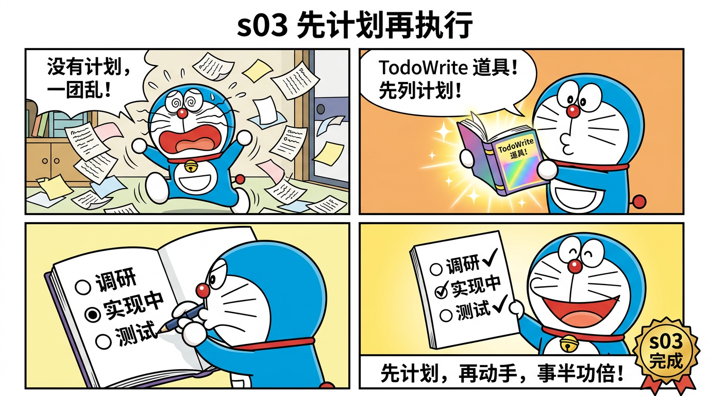
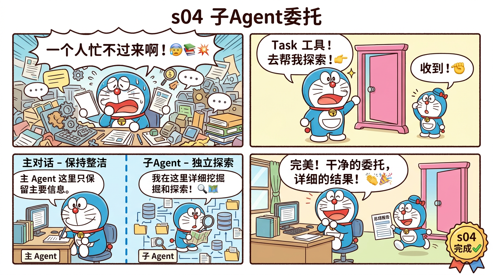
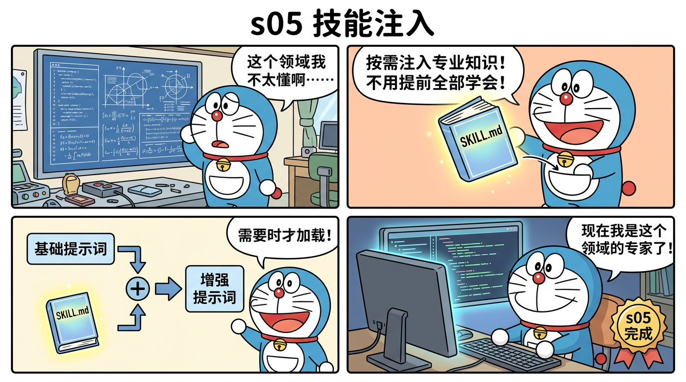
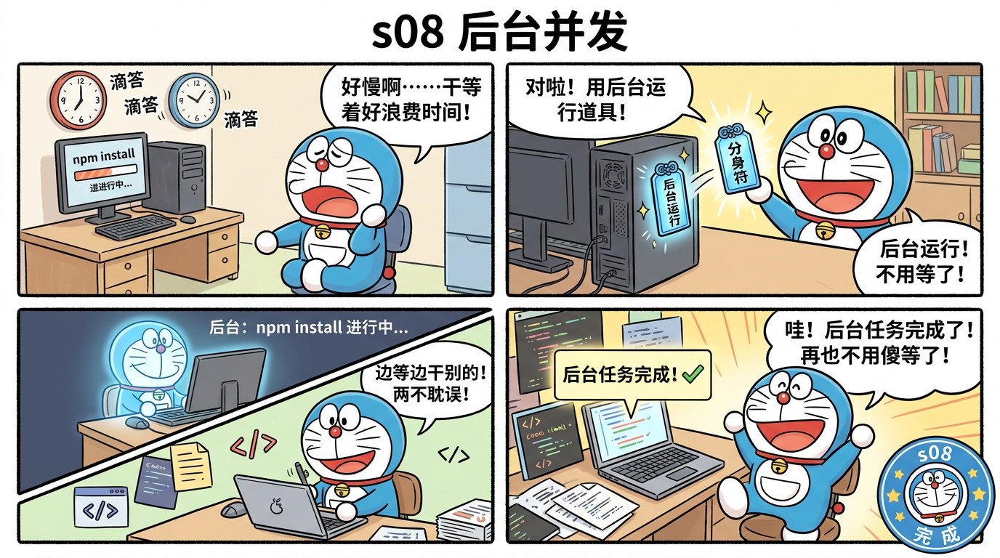

# miniclaudecode_typescript

> Claude Code 500,000+ 行 TypeScript 蒸馏为 12 个渐进式阶段 — 从一个 while 循环到多 Agent 团队

[](https://www.typescriptlang.org)
[](LICENSE)
[]()

**📖 [在线阅读文档](https://bcefghj.github.io/miniclaudecode_typescript/)**

## 这是什么？


这是目前**唯一直接从 Claude Code 真实 TypeScript 源码蒸馏**的教学项目。不是行为推断，不是 Python 翻译，而是拿着 51 万行源码一行行提取核心模式，浓缩为 ~4,250 行可运行的 TypeScript。

```
Claude Code (512,664 行 TS) ──蒸馏──> miniclaudecode (4,250 行 TS)
                                     压缩比 ≈ 120:1
```

### 什么是"蒸馏"？

> 就像把一本 500 页的教科书浓缩成 12 页的笔记——保留核心思想，去掉冗余细节。每一行蒸馏代码都可以追溯到原版 Claude Code 的具体文件和行号。

### 什么是 AI Agent？

> 普通的聊天机器人只能"你问我答"。AI Agent 多了一个能力：**它可以使用工具**（执行命令、读写文件、搜索代码等），在一个循环中反复调用工具直到完成任务。Claude Code、Cursor、GitHub Copilot 底层都是这个模式。

## 快速开始

```bash
# 克隆
git clone https://github.com/bcefghj/miniclaudecode_typescript.git
cd miniclaudecode_typescript

# 安装依赖
npm install

# 设置 API Key（到 https://console.anthropic.com/ 申请）
export ANTHROPIC_API_KEY="your-key-here"

# 从最简单的开始！
npx tsx src/s01_agent_loop.ts
```

输入 `帮我看看当前目录有什么文件`，你的第一个 AI Agent 就在工作了！

## 12 个阶段一览

### 🟢 入门篇（s01-s03）— 理解核心循环

| 阶段 | 主题 | 运行命令 | 漫画 |
|------|------|---------|------|
| s01 | **核心循环** — while(true) + Bash | `npm run s01` |  |
| s02 | **工具系统** — 分发表 + Read/Write/Edit | `npm run s02` |  |
| s03 | **先计划再执行** — TodoWrite | `npm run s03` |  |

### 🟡 进阶篇（s04-s06）— 智能扩展

| 阶段 | 主题 | 运行命令 | 漫画 |
|------|------|---------|------|
| s04 | **子Agent委托** — 独立上下文 | `npm run s04` |  |
| s05 | **技能注入** — SKILL.md 按需加载 | `npm run s05` |  |
| s06 | **三层压缩** — 对话永不中断 | `npm run s06` |  |

### 🔴 高级篇（s07-s09）— 多Agent协作

| 阶段 | 主题 | 运行命令 | 漫画 |
|------|------|---------|------|
| s07 | **文件任务图** — DAG 依赖管理 | `npm run s07` |  |
| s08 | **后台并发** — 非阻塞执行 | `npm run s08` |  |
| s09 | **Agent团队** — JSONL 邮箱通信 | `npm run s09` |  |

### ⚫ 专家篇（s10-s12）— 生产级架构

| 阶段 | 主题 | 运行命令 | 漫画 |
|------|------|---------|------|
| s10 | **团队协议** — 请求-响应审批 | `npm run s10` |  |
| s11 | **自主Agent** — 自动认领任务 | `npm run s11` |  |
| s12 | **Git隔离** — Worktree 并行 | `npm run s12` |  |

## 对比其他项目

| 特性 | miniclaudecode (本项目) | learn-claude-code | cc-mini | ClaudeLite |
|------|----------------------|-------------------|---------|------------|
| 语言 | **TypeScript** (与原版一致) | Python | TypeScript | Python |
| 阶段数 | **12** | 12 | 1 | 1 |
| 总代码量 | **~4,250 行** | ~3,400 行 | ~800 行 | ~600 行 |
| 源码映射 | **有 (每行标注)** | 无 | 无 | 无 |
| 蒸馏方式 | **真实源码蒸馏** | 行为推断 | 参考文档 | 参考文档 |
| 教学漫画 | **哆啦A梦风格** | 无 | 无 | 无 |
| 在线文档 | **Docsify** | 无 | 无 | 无 |

## 项目结构

```
miniclaudecode_typescript/
├── src/                      # 12 阶段源码
│   ├── s01_agent_loop.ts     # ~100 行 — 一个循环 + Bash
│   ├── s02_tools.ts          # ~200 行 — 工具注册 dispatch
│   ├── ...
│   └── s12_worktree.ts       # ~550 行 — Git Worktree 隔离
├── comics/                   # 13 张哆啦A梦教学漫画（中文）
├── docs/                     # 文档 + Docsify 在线站
│   ├── tutorials/            # 12 个分阶段教程
│   ├── architecture.md       # 架构对比
│   ├── source-mapping.md     # 源码映射表（独家）
│   └── index.html            # Docsify 入口
├── legacy/                   # 旧版 v0-v4
└── package.json
```

## 环境要求

- **Node.js** 18+（[下载](https://nodejs.org/)）
- **Anthropic API Key**（[申请](https://console.anthropic.com/)）
- **Git**（s12 需要）
- **ripgrep**（可选，Grep 工具使用）

## 蒸馏统计

| 阶段 | 原始行数 | 蒸馏行数 | 压缩比 |
|------|---------|---------|--------|
| s01 Agent Loop | 1,825 | ~100 | 18:1 |
| s02 Tools | 2,320 | ~200 | 11.6:1 |
| s03 TodoWrite | 335 | ~250 | 1.3:1 |
| s04 Subagents | 2,112 | ~300 | 7:1 |
| s05 Skills | 1,740 | ~350 | 5:1 |
| s06 Compact | 2,786 | ~400 | 7:1 |
| s07 Tasks | 1,566 | ~350 | 4.5:1 |
| s08 Background | 772 | ~350 | 2.2:1 |
| s09 Teams | 2,372 | ~450 | 5.3:1 |
| s10 Protocols | 1,039 | ~450 | 2.3:1 |
| s11 Autonomous | 795 | ~500 | 1.6:1 |
| s12 Worktree | 2,126 | ~550 | 3.9:1 |
| **合计** | **19,788** | **~4,250** | **4.7:1** |

> 详细映射见 [docs/source-mapping.md](docs/source-mapping.md)

## 致谢

- [Claude Code](https://docs.anthropic.com/en/docs/claude-code) by Anthropic
- [learn-claude-code](https://github.com/shareAI-lab/learn-claude-code) 启发了渐进式教学结构
- [cc-mini](https://github.com/e10nMa2k/cc-mini), [ClaudeLite](https://github.com/davidweidawang/ClaudeLite) 先行者

## License

MIT
