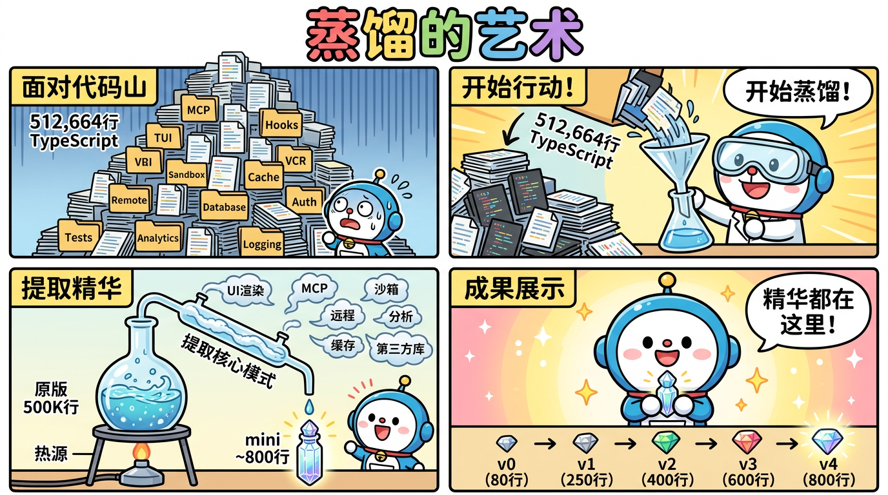
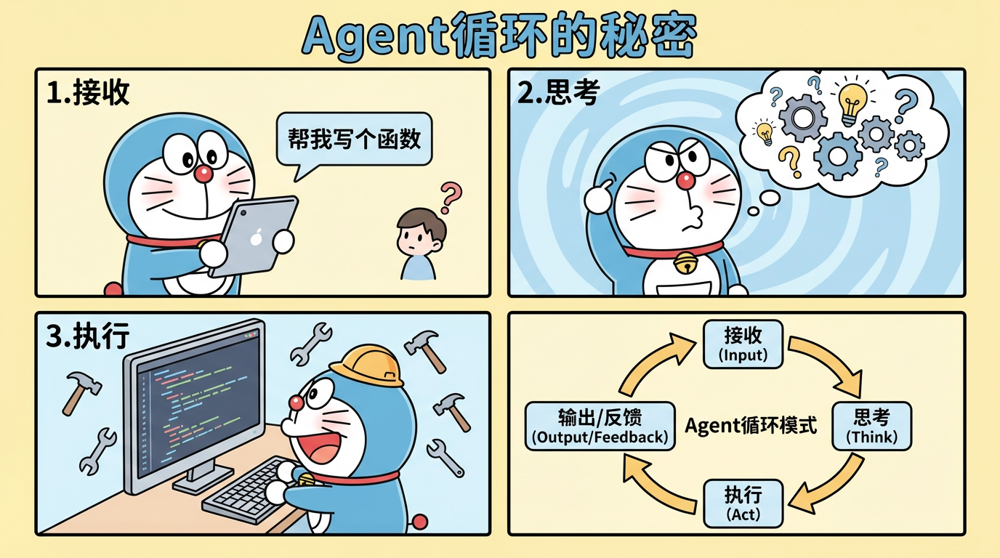
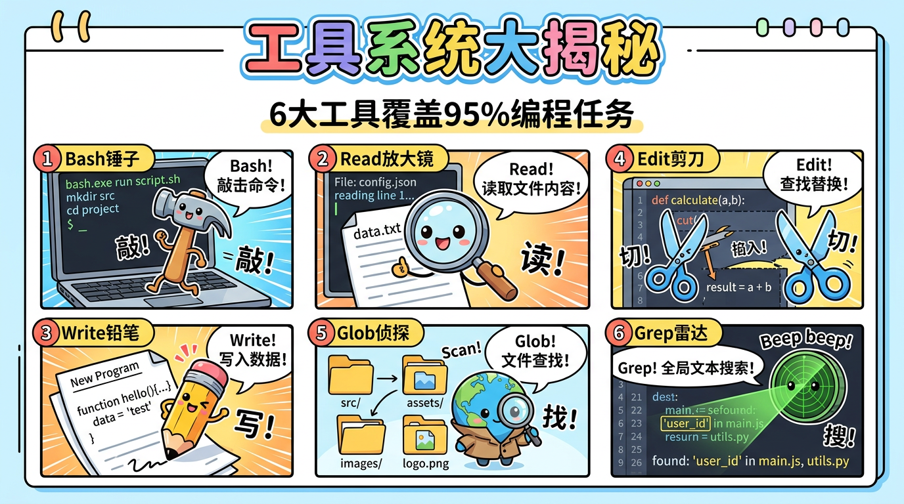
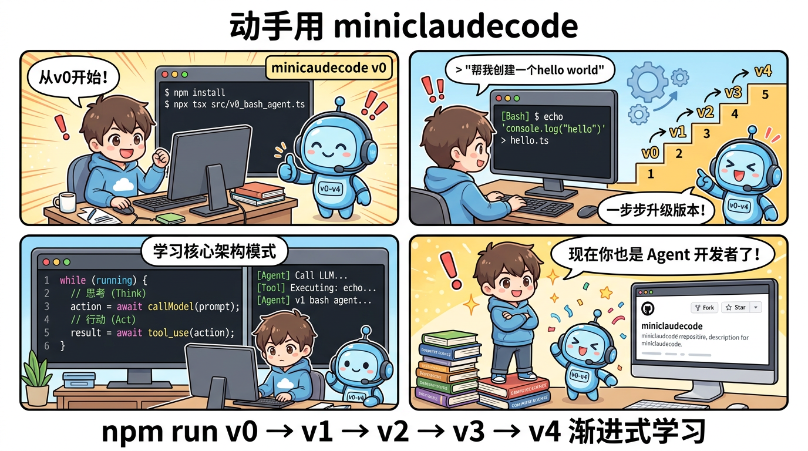

# miniclaudecode_typescript

> Claude Code 的 512,664 行 TypeScript 源码，蒸馏为 ~800 行的渐进式学习框架。



## 这是什么？

**miniclaudecode_typescript** 是一个教学项目，将 Anthropic 的 [Claude Code](https://docs.anthropic.com/en/docs/claude-code) （50万+行 TypeScript）蒸馏为 5 个渐进式版本，帮助你从零理解 AI 编程 Agent 的核心架构。

每个版本都是**可运行**的独立程序，逐步添加一个新概念：

| 版本 | 行数 | 新增概念 | 核心洞察 |
|------|------|---------|---------|
| v0 | ~110 | 1 个 Bash 工具 | Agent = 循环 + 工具 |
| v1 | ~266 | 4 个核心工具 | 模型即 Agent |
| v2 | ~354 | 流式输出 + Token 追踪 | 实时反馈 |
| v3 | ~465 | 子 Agent + Todo 系统 | 分治法 |
| v4 | ~688 | 技能 + 权限 + 压缩 | 完整 Agent |

## 快速开始

```bash
# 1. 克隆仓库
git clone https://github.com/bcefghj/miniclaudecode_typescript.git
cd miniclaudecode_typescript

# 2. 安装依赖
npm install

# 3. 设置 API Key
export ANTHROPIC_API_KEY="your-key-here"

# 4. 运行任意版本
npm run v0  # 最简版 — 从这里开始理解
npm run v1  # 基础版 — 4 个工具
npm run v2  # 流式版 — 实时输出
npm run v3  # 子Agent版 — 任务分解
npm run v4  # 完整版 — 生产级 Agent
```

## 架构图

```
Agent 循环的核心模式（所有版本共享）:

while (true) {
  response = callModel(messages, tools)
  if (response.stop_reason !== "tool_use") → return text
  for each tool_use:
    result = executeTool(tool)
    messages.push(tool_result)
  continue
}
```



## 工具系统

6 个核心工具覆盖 95% 的编程任务：



| 工具 | 用途 | 对应 Claude Code 源文件 |
|------|------|----------------------|
| Bash | 运行命令 | `tools/BashTool/` (~800行) |
| Read | 读取文件 | `tools/FileReadTool/` (~500行) |
| Write | 写入文件 | `tools/FileWriteTool/` (~400行) |
| Edit | 编辑文件 | `tools/FileEditTool/` (~600行) |
| Glob | 搜索文件 | `tools/GlobTool/` |
| Grep | 搜索内容 | `tools/GrepTool/` |

## 项目结构

```
miniclaudecode_typescript/
├── src/
│   ├── v0_bash_agent.ts      # 最小 Agent: 1 工具 + 循环
│   ├── v1_basic_agent.ts     # 基础 Agent: Bash/Read/Write/Edit
│   ├── v2_streaming_agent.ts # 流式 Agent: 实时输出 + 费用追踪
│   ├── v3_subagent.ts        # 子 Agent: Task + TodoWrite
│   ├── v4_full_agent.ts      # 完整 Agent: 权限 + 技能 + 压缩
│   ├── core/                 # 模块化核心组件
│   │   ├── agentLoop.ts      # Agent 循环引擎
│   │   ├── api.ts            # Anthropic API 封装
│   │   ├── types.ts          # 类型定义
│   │   └── permissions.ts    # 权限系统
│   └── tools/                # 模块化工具实现
│       ├── bash.ts
│       ├── fileRead.ts
│       ├── fileWrite.ts
│       ├── fileEdit.ts
│       ├── glob.ts
│       ├── grep.ts
│       └── index.ts
├── comics/                   # 教学漫画 (哆啦A梦风格)
├── docs/                     # 详细文档
└── package.json
```

## 蒸馏方法

从 Claude Code 的 51 万行中提取核心模式，而非复制代码：

1. **识别核心循环** — `query.ts` (1730行) → `agentLoop.ts` (166行)
2. **简化 API 层** — `services/api/claude.ts` (3420行) → `api.ts` (83行)
3. **精简工具类型** — `Tool.ts` (793行) → `types.ts` (59行)
4. **保留本质模式** — 去掉 MCP、TUI、VCR、sandbox、analytics 等

详见 [蒸馏指南](docs/distillation-guide.md)。

## 学习路径



1. **读 v0** → 理解 Agent 循环的本质（最重要）
2. **读 v1** → 理解工具如何扩展 Agent 的能力
3. **读 v2** → 理解流式输出和成本控制
4. **读 v3** → 理解子 Agent 和任务规划
5. **读 v4** → 理解权限、技能和上下文管理
6. **读 `core/` + `tools/`** → 理解模块化设计

## 参考项目

本项目在以下开源工作的基础上学习和借鉴：

- [shareAI-lab/mini-claude-code](https://github.com/shareAI-lab/mini-claude-code) — 渐进式 Python 教程 (v0-v4)
- [e10nMa2k/cc-mini](https://github.com/e10nMa2k/cc-mini) — 800行最小复现
- [davidweidawang/ClaudeLite](https://github.com/davidweidawang/ClaudeLite) — Python 核心架构复现
- [yinwm/minicc](https://github.com/yinwm/minicc) — 教育性最小实现
- [oboard/claude-code-rev](https://github.com/oboard/claude-code-rev) — 完整源码还原

## 环境变量

| 变量 | 说明 | 默认值 |
|------|------|--------|
| `ANTHROPIC_API_KEY` | Anthropic API 密钥 | (必须设置) |
| `MINICC_MODEL` | 使用的模型 | `claude-sonnet-4-20250514` |

## License

MIT
