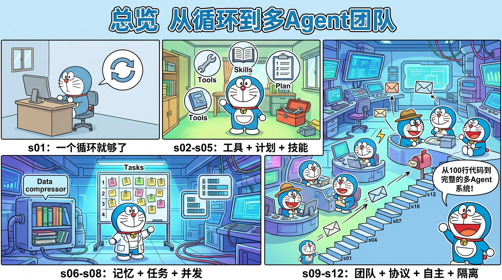

# miniclaudecode_typescript

> Claude Code 50万行 TypeScript 源码 → 12 个阶段 → 4,250 行教学代码

## 这个项目是什么？

**用最简单的话说**：Claude Code 是 Anthropic 做的 AI 编程助手，有 50 多万行 TypeScript 代码。这个项目把它的核心架构**蒸馏**成 12 个小程序，每个只有几百行，让你从零理解 AI Agent 是怎么工作的。

**蒸馏**就像把一本 500 页的教科书浓缩成 12 页的笔记——保留核心思想，去掉冗余细节。

## 为什么学这个？

- 想了解 Claude Code / Cursor / AI 编程助手是怎么工作的
- 想自己做一个 AI Agent
- 想从源码层面理解 AI Agent 架构
- 找工作时需要了解 AI Agent 系统设计

## 快速开始

👉 [快速开始指南](quickstart.md)

## 12 个阶段教程

每个阶段都有配套的哆啦A梦漫画、逐行代码讲解、源码映射和动手练习：

| 阶段 | 主题 | 漫画 |
|------|------|------|
| [s01](tutorials/s01-agent-loop.md) | 核心循环 — 一切的起点 |  |
| [s02](tutorials/s02-tools.md) | 工具系统 — 分发表模式 |  |
| [s03](tutorials/s03-todo.md) | 先计划再执行 |  |
| [s04](tutorials/s04-subagent.md) | 子Agent委托 |  |
| [s05](tutorials/s05-skills.md) | 技能注入 |  |
| [s06](tutorials/s06-compact.md) | 三层压缩 |  |
| [s07](tutorials/s07-tasks.md) | 文件任务图 |  |
| [s08](tutorials/s08-background.md) | 后台并发 |  |
| [s09](tutorials/s09-teams.md) | Agent团队 |  |
| [s10](tutorials/s10-protocols.md) | 团队协议 |  |
| [s11](tutorials/s11-autonomous.md) | 自主Agent |  |
| [s12](tutorials/s12-worktree.md) | Git隔离 |  |

## 深入理解

- [架构对比](architecture.md) — 原版 vs 蒸馏版的架构对照
- [蒸馏方法](distillation-guide.md) — 如何从 50 万行代码提取核心
- [功能对比](comparison.md) — 与其他同类项目的对比
- [源码映射表](source-mapping.md) — 每一行蒸馏代码对应原版哪里（独家）
