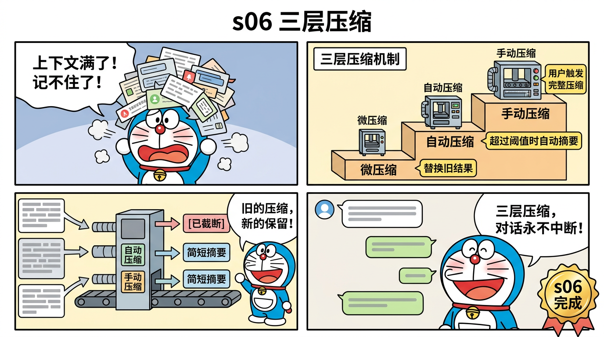

# 对比分析

> 市面上有好几个"简化版 Claude Code"项目，我们和它们有什么不同？


## 现有 Claude Code 蒸馏/复现项目

### 1. miniclaudecode_typescript (本项目)

- **语言**: TypeScript
- **方法**: 直接从 Claude Code v2.1.88 源码蒸馏
- **阶段**: 12 个渐进式阶段
- **代码量**: ~4,250 行 (不含 core/ 和 tools/ 共享模块)
- **独特优势**: 源码映射表、哆啦A梦漫画教学、原生 TypeScript

### 2. learn-claude-code (Python, 45K+ stars)

- **语言**: Python
- **方法**: 从行为推断 + 后期源码验证
- **阶段**: 12 个阶段 (s01-s12)
- **代码量**: ~3,400 行 Python
- **优势**: 社区大、教程完善
- **劣势**: Python 与原版 TypeScript 不同语言，存在翻译偏差

### 3. cc-mini (TypeScript, 800 行)

- **语言**: TypeScript
- **方法**: 参考文档实现最小版本
- **阶段**: 1 个 (单文件)
- **代码量**: ~800 行
- **优势**: 极简、单文件
- **劣势**: 无渐进式学习、无高级功能

### 4. ClaudeLite (Python, 600 行)

- **语言**: Python
- **方法**: 参考文档实现
- **阶段**: 1 个
- **代码量**: ~600 行
- **优势**: 简洁
- **劣势**: Python、无高级功能

### 5. start-claude-code

- **语言**: TypeScript
- **方法**: 开箱即用封装
- **重点**: 快速启动，非教学

## 功能对比矩阵

| 功能 | miniclaudecode | learn-claude-code | cc-mini | ClaudeLite |
|------|:---:|:---:|:---:|:---:|
| Agent Loop | ✅ | ✅ | ✅ | ✅ |
| 多工具 dispatch | ✅ | ✅ | ✅ | ✅ |
| 流式输出 | ✅* | ✅ | ✅ | ✅ |
| TodoWrite | ✅ | ✅ | ❌ | ❌ |
| 子 Agent | ✅ | ✅ | ❌ | ❌ |
| 技能注入 | ✅ | ✅ | ❌ | ❌ |
| 上下文压缩 | ✅ (三层) | ✅ (双层) | ❌ | ❌ |
| 文件任务图 | ✅ | ✅ | ❌ | ❌ |
| 后台任务 | ✅ | ✅ | ❌ | ❌ |
| Agent 团队 | ✅ | ✅ | ❌ | ❌ |
| 团队协议 | ✅ | ✅ | ❌ | ❌ |
| 自主 Agent | ✅ | ✅ | ❌ | ❌ |
| Git Worktree | ✅ | ✅ | ❌ | ❌ |
| 源码映射 | ✅ | ❌ | ❌ | ❌ |
| 教学漫画 | ✅ | ❌ | ❌ | ❌ |
| TypeScript 原生 | ✅ | ❌ | ✅ | ❌ |

*s05 使用非流式 API 保持简洁，生产版可切换流式

## 独家优势详解

### 源码映射 (Source Mapping)

本项目每个阶段的代码注释都标注了对应的 Claude Code 原始文件和行号：

```typescript
/**
 * SOURCE MAPPING:
 *   services/compact/microCompact.ts (530行) → microCompact() 这里
 *   services/compact/autoCompact.ts (351行) → autoCompact() 这里
 */
```

这让你可以直接对照原版源码理解蒸馏过程。其他项目都没有这个。

### 同语言蒸馏

Claude Code 是 TypeScript 写的。用 TypeScript 蒸馏意味着：

- 类型完全一致 (Anthropic SDK 的类型)
- 模块模式一致 (ES modules)
- 运行时一致 (Node.js)
- API 调用方式一致

Python 蒸馏会引入语言差异，无法直接对照原版。

### 三层压缩 vs 双层压缩



learn-claude-code 实现了 micro + manual 两层。本项目实现了完整的三层：

1. **microCompact** — 被动，每轮自动替换旧结果
2. **autoCompact** — 自动，token 超阈值时触发摘要
3. **manualCompact** — 手动，用户/工具显式触发完整压缩

### 教学漫画

本项目配套 13 张哆啦A梦风格中文教学漫画，覆盖每个阶段的核心概念。用漫画辅助理解技术概念，降低学习门槛。其他项目均无此特色。

### 在线文档

通过 Docsify 搭建的在线阅读站，支持搜索、代码高亮、侧边栏导航，方便随时随地学习。访问地址：[https://bcefghj.github.io/miniclaudecode_typescript/](https://bcefghj.github.io/miniclaudecode_typescript/)
