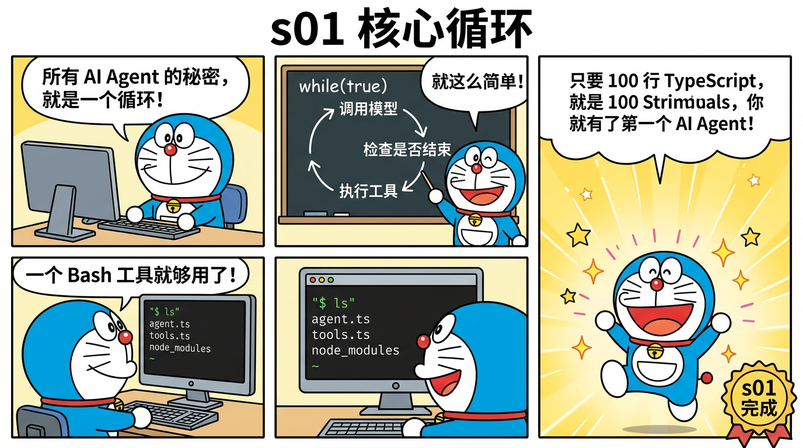

# 蒸馏方法论 (Distillation Guide)



## 什么是"蒸馏"？

> 你有一本 500 页的教科书，但期末考试只考核心内容。你把重点整理成 12 页笔记——这就是蒸馏。

蒸馏 (Distillation) 是从复杂系统中提取核心模式的过程。就像从一瓶酒中蒸馏出酒精——去掉水分、杂质，保留精华。

```
Claude Code (512,664 行)
    │
    │  蒸馏过程
    │  - 去掉错误处理的冗余层
    │  - 合并抽象层次
    │  - 内联依赖注入
    │  - 保留核心算法模式
    │
    ▼
miniclaudecode (~4,250 行)
    每一行都对应原版的核心逻辑
```

## 蒸馏步骤

### Step 1: 找到核心循环

一切 AI Agent 的核心是同一个循环：

```typescript
while (true) {
  response = await callModel(messages);
  if (response.stop_reason !== "tool_use") break;
  results = await executeTools(response.tool_calls);
  messages.push(results);
}
```

原版在 `query.ts` 用了 1730 行来做这件事（加上重试、流式、错误处理、hooks）。蒸馏后只需 ~20 行。

### Step 2: 识别工具模式

原版的每个工具都是一个类，有 `getInputSchema()`、`checkPermissions()`、`call()` 等方法。蒸馏发现核心模式其实是：

```typescript
const HANDLERS: Record<string, (input: any) => string> = {
  Bash: (i) => execSync(i.command),
  Read: (i) => readFileSync(i.path),
  // ...
};
```

一个 dispatch map 就够了。

### Step 3: 提取状态管理

原版有复杂的 AppState、Redux-like 状态管理。蒸馏后发现核心状态就是：

- `messages[]` — 对话历史
- `todos[]` — 任务列表
- `tasks/` — 持久化任务文件
- `.team/inbox/` — 团队消息

### Step 4: 分层递增

把功能按依赖关系排列，每层只加一个新概念：

```
s01: while + tool        (基础)
s02: + dispatch map      (扩展)
s03: + planning          (规划)
s04: + delegation        (委托)
s05: + knowledge         (知识)
s06: + memory mgmt       (记忆)
s07: + task graph         (任务)
s08: + concurrency        (并发)
s09: + multi-agent       (团队)
s10: + negotiation       (协商)
s11: + autonomy          (自主)
s12: + isolation         (隔离)
```

## 蒸馏比例

不同模块的蒸馏难度不同：

| 模块 | 原版行数 | 蒸馏行数 | 蒸馏比 | 原因 |
|------|---------|---------|--------|------|
| Agent Loop | 1,825 | 100 | 18:1 | 核心模式极简，大量是错误处理 |
| Tools | 2,320 | 200 | 11.6:1 | 类→函数，移除权限层 |
| Compact | 2,786 | 400 | 7:1 | 三层策略明确，简化 token 计算 |
| Autonomous | 795 | 500 | 1.6:1 | 逻辑本身就紧凑 |

## 你能学到什么？

通过蒸馏学习，你会理解：

1. **大型系统的核心往往很小** — 500K 行的核心循环就 20 行
2. **抽象是为了扩展** — 原版的类层次为了插件系统，教学可以用函数
3. **状态管理是关键** — 理解 messages[]、tasks、inbox 的数据流
4. **并发用消息传递** — 不共享内存，用文件邮箱通信
5. **隔离用 worktree** — Git 原生支持并行工作目录

## 如何自己蒸馏一个系统？


1. **找到入口点** — 哪个函数启动了一切？（比如 Claude Code 的 `query.ts:queryLoop`）
2. **画调用图** — 入口函数调用了哪些函数？
3. **识别核心 vs 基础设施** — 重试逻辑不是核心，循环结构是核心
4. **提取类型** — 核心数据结构是什么样的？
5. **从最小可运行版本开始** — 先让最简版本跑起来（就像我们的 s01，100 行就够）
6. **每次加一个功能** — 每加一个功能就对照原版理解为什么需要它

### 实际例子：蒸馏 Claude Code 的上下文压缩

**原版**（2,786 行）做了什么？
- 精确的 token 计数（用 tiktoken 库）
- 多种压缩策略（按消息类型、按工具类型）
- 压缩后的质量评估
- 压缩历史追踪
- 错误恢复机制
- 单元测试

**蒸馏版**（400 行）保留了什么？
- 简单的 token 估算（JSON 长度 / 4）
- 三层压缩策略（保留了核心思想）
- 磁盘持久化
- 模型生成摘要

**去掉了什么？**
- 精确 token 计数（教学不需要 100% 精确）
- 多种压缩策略（保留三层足够理解）
- 质量评估（教学不需要）
- 错误恢复（简单 try-catch 够了）

> 蒸馏的关键：**问"这段代码是为了实现核心功能，还是为了处理边界情况？"** 如果是边界情况，教学版可以跳过。
