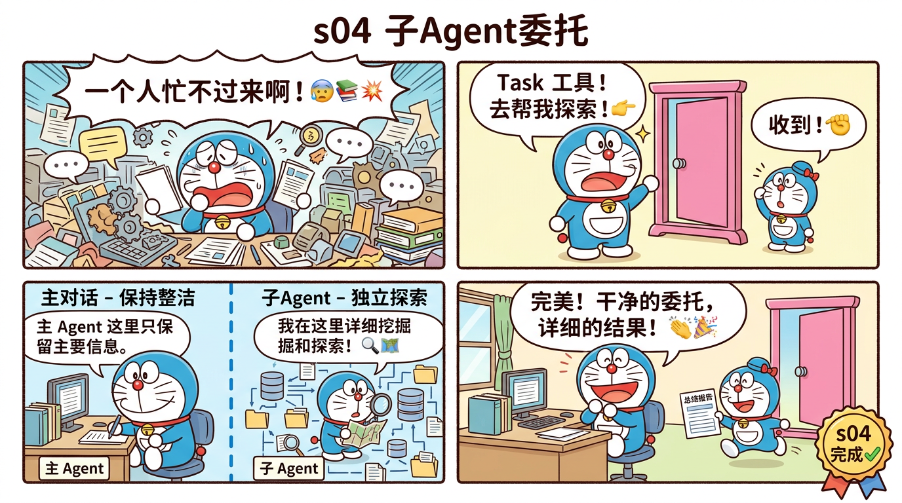

# s04 子Agent委托 — 独立上下文的任务分发



## 这一节学什么？

**一句话**：当主 Agent 需要深入探索某个问题时，派一个"子Agent"去干，子Agent干完汇报结果，主Agent的对话保持干净。

这就像老板不用亲自去调研——派助手去，助手回来汇报要点就行。

## 核心概念：上下文隔离

### 问题

如果主 Agent 要探索一个大项目的结构，它需要调用很多 Glob、Read、Grep。这些工具的输出会塞满对话历史（`messages[]`），后面的对话质量会下降。

### 解决

子 Agent 用**独立的 `messages[]`**。主 Agent 只看到子 Agent 的最终总结。

```
主 Agent messages[]:
  [user] "分析这个项目结构"
  [assistant] tool_use: Task({description: "探索项目", prompt: "..."})
  [user] tool_result: "这个项目有 3 个模块：..."  ← 子Agent的总结

子 Agent messages[] (独立的，主Agent看不到):
  [user] "探索项目"
  [assistant] tool_use: Glob(*.ts)
  [user] tool_result: "src/a.ts\nsrc/b.ts\n..."
  [assistant] tool_use: Read("src/a.ts")
  [user] tool_result: "(200行代码)"
  [assistant] "这个项目有 3 个模块..."
```

### 实现

```typescript
async function runSubAgent(
  description: string,
  prompt: string,
  depth: number
): Promise<string> {
  if (depth > 3) return "Error: max nesting depth reached";

  // 独立的消息历史！
  const msgs: Anthropic.MessageParam[] = [
    { role: "user", content: prompt }
  ];
  let result = "";

  for (let turn = 0; turn < 15; turn++) {
    const resp = await client.messages.create({
      model: MODEL,
      max_tokens: 8192,
      system: "You are a focused sub-agent. Complete the task and return a concise summary.",
      tools: subTools,
      messages: msgs,  // ← 注意：是 msgs，不是主Agent的 messages
    });
    // ... 执行工具 ...
  }
  return result;  // 只返回最终文字给主Agent
}
```

### 防无限递归

子 Agent 也可以调用 Task 工具（生成子子 Agent），通过 `depth` 参数限制最多 3 层嵌套。

## 新增工具：Glob 和 Grep

本节还新增了两个搜索工具：

- **Glob**：按文件名模式查找文件（如 `*.ts`）
- **Grep**：按内容搜索文件（用 `rg` / ripgrep）

这让 Agent（特别是子 Agent）能够高效地探索代码库。

## 源码映射

| 蒸馏版 | Claude Code 原版 | 原始行数 |
|--------|-----------------|---------|
| Task 工具 | `AgentTool.tsx` | 1,397 行 |
| 独立 msgs[] | `QueryEngine per invocation` | 200 行 |
| depth 限制 | `MAX_DEPTH = 3` | 15 行 |
| Glob | `GlobTool/` | 280 行 |
| Grep | `GrepTool/` | 220 行 |
| **总计** | | **2,112 → ~300 行 (7:1)** |

## 动手试试

```bash
npx tsx src/s04_subagent.ts
```

试试：
- `分析 src/ 目录下所有文件的功能`
- `对比 s01 和 s02 的代码差异`

观察终端输出，会看到 `⤷ Sub-agent:` 和 `⤶ Sub-agent done` 标记。

## 小测验

1. **子Agent为什么要用独立的 `messages[]`？** 不用独立的会怎样？
2. **为什么限制最大深度为 3？** 如果不限制呢？
3. **子Agent的工具集和主Agent一样吗？** 为什么？

---

> 下一节：[s05 技能注入](./s05-skills.md) — 按需加载专业知识
