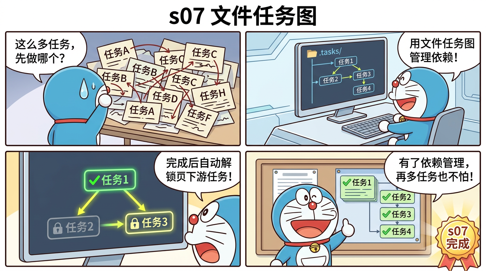

# s07 文件任务图 — DAG 依赖管理



## 这一节学什么？

**一句话**：s03 的 TodoWrite 存在内存里，重启就没了。s07 用文件存储任务，还支持任务之间的依赖关系（DAG）。

"任务 B 依赖任务 A" = "A 没完成，B 就不能开始"。

## 核心概念

### 任务数据结构

```typescript
interface Task {
  id: string;
  subject: string;        // 短标题
  description: string;    // 详细描述
  status: "pending" | "in_progress" | "completed";
  owner?: string;          // 谁在做
  blocks: string[];        // 我完成后可以解锁哪些任务
  blockedBy: string[];     // 谁没完成我就不能开始
}
```

### 文件存储

每个任务保存为独立 JSON 文件：
```
.tasks/
├── task_1.json   ← {"id":"1","subject":"设计接口",...}
├── task_2.json   ← {"id":"2","subject":"实现功能","blockedBy":["1"],...}
└── task_3.json   ← {"id":"3","subject":"写测试","blockedBy":["2"],...}
```

### DAG 依赖管理

```typescript
create(subject, description, blockedBy = []) {
  const task = { id, subject, description, status: "pending", blocks: [], blockedBy };
  // 关键：更新上游任务的 blocks 数组
  for (const bid of blockedBy) {
    const blocker = this.get(bid);
    if (blocker) blocker.blocks.push(id);
  }
  this.save(task);
}

// 任务完成时，自动解除下游的依赖
update(id, { status: "completed" }) {
  if (status === "completed") {
    for (const other of this.listAll()) {
      const idx = other.blockedBy.indexOf(id);
      if (idx !== -1) {
        other.blockedBy.splice(idx, 1);  // 删除依赖
        this.save(other);
      }
    }
  }
}
```

**效果**：任务 1 完成后，任务 2 的 `blockedBy` 自动清空，变成可执行状态。

### 可视化

```
○ #1 [pending] 设计接口
○ #2 [pending] 实现功能 [blocked by: 1]
○ #3 [pending] 写测试 [blocked by: 2]
```

完成 #1 后：
```
✓ #1 [completed] 设计接口
○ #2 [pending] 实现功能           ← 不再被阻塞！
○ #3 [pending] 写测试 [blocked by: 2]
```

## 对比 s03 TodoWrite

| 特性 | s03 TodoWrite | s07 Tasks |
|------|-------------|-----------|
| 存储 | 内存 | 文件 (.tasks/) |
| 持久化 | 否 | 是 |
| 依赖关系 | 无 | DAG |
| 自动解锁 | 无 | 有 |
| 多人协作 | 不支持 | 支持 (owner) |

## 源码映射

| 蒸馏版 | Claude Code 原版 | 原始行数 |
|--------|-----------------|---------|
| `TaskManager` | `utils/tasks.ts` | 862 行 |
| `task_create` | `TaskCreateTool/` | 138 行 |
| `task_update` | `TaskUpdateTool/` | 406 行 |
| **总计** | | **1,566 → ~350 行 (4.5:1)** |

## 动手试试

```bash
npx tsx src/s07_tasks.ts
```

试试：
- `创建三个任务：设计、实现、测试，后面的依赖前面的`
- 输入 `tasks` 查看任务状态
- `完成第一个任务`，再看看任务状态变化

## 小测验

1. **如果任务之间的依赖形成环怎么办？** 如 A→B→C→A
2. **为什么每个任务用独立文件而不是一个大 JSON？**
3. **如何支持并行任务？** 提示：两个任务可以同时 `in_progress` 吗？

---

> 下一节：[s08 后台并发](./s08-background.md) — 让 Agent 边等边干别的
