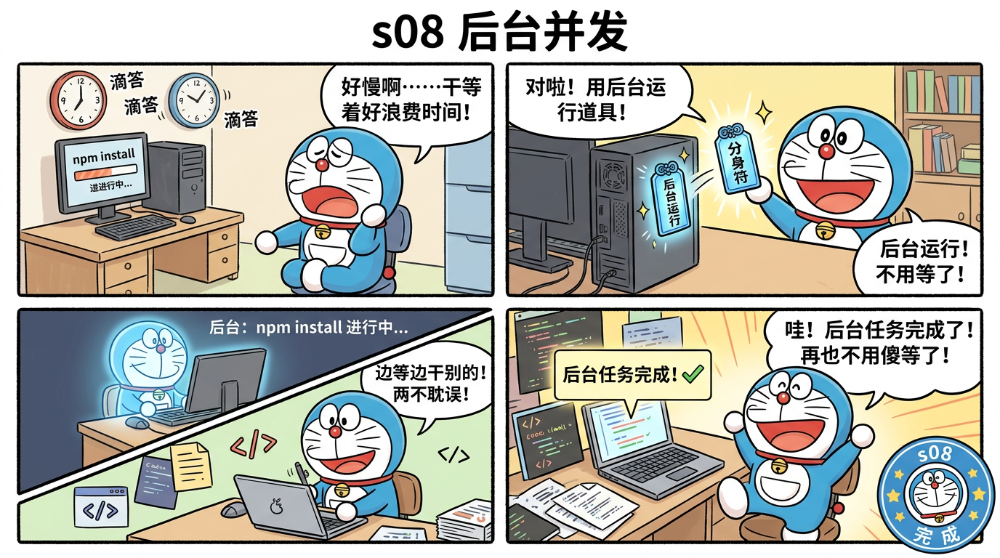

# s08 后台并发 — 边等边干别的



## 这一节学什么？

**一句话**：`npm install` 要跑 30 秒，Agent 不用傻等——把它扔到后台，继续干别的。

之前所有的工具调用都是**同步阻塞**的：执行命令时 Agent 什么都不能做。后台并发解决了这个问题。

## 核心概念

### 阻塞 vs 非阻塞

```
阻塞 (s01-s07):
  Agent → Bash("npm install") → 等30秒 → 拿到结果 → 继续

非阻塞 (s08):
  Agent → background_run("npm install") → 立刻返回 → 继续干别的
                                              ↓
                              30秒后通知："npm install 完成了"
```

### BackgroundManager

```typescript
class BackgroundManager {
  private tasks = new Map<string, BgTask>();
  private notifications: Notification[] = [];

  run(command: string): string {
    const id = `bg_${this.nextId++}`;
    // 用 spawn 而不是 execSync
    const child = spawn("bash", ["-c", command], { cwd: process.cwd() });

    // 异步收集输出
    child.stdout.on("data", (data) => { stdout += data.toString(); });
    child.stderr.on("data", (data) => { stderr += data.toString(); });

    // 完成时推入通知队列
    child.on("close", (code) => {
      task.status = code === 0 ? "completed" : "failed";
      task.result = stdout + stderr;
      this.notifications.push({ taskId: id, status: task.status, ... });
    });

    return `Started background task ${id}: ${command}`;
  }
}
```

关键区别：
- **`execSync`**（同步）：调用后程序停住，直到命令完成
- **`spawn`**（异步）：调用后立刻返回，命令在后台跑

### 通知注入

```typescript
async function agentLoop(messages) {
  for (let turn = 0; turn < 50; turn++) {
    // 每一轮循环开头，检查后台任务完成通知
    const notifications = bgMgr.drainNotifications();
    if (notifications) {
      messages.push({
        role: "user",
        content: `[System notification]\n${notifications}`
      });
    }
    // ... 正常循环 ...
  }
}
```

后台任务完成后，结果作为"系统通知"注入到对话中，模型就能看到了。

## 使用场景

| 适合放后台 | 不适合放后台 |
|-----------|-------------|
| `npm install` | 读文件（太快了） |
| `npm run build` | 简单的 ls |
| `npm test` | 需要立刻看结果的 |
| 长时间编译 | 交互式命令 |

## 源码映射

| 蒸馏版 | Claude Code 原版 | 原始行数 |
|--------|-----------------|---------|
| `BackgroundManager` | `LocalShellTask/` | 522 行 |
| `background_run` | `BashTool:run_in_background` | 80 行 |
| 通知队列 | `BackgroundTaskNotifier` | 120 行 |
| `drainNotifications` | `query.ts:injectNotifications()` | 50 行 |
| **总计** | | **772 → ~350 行 (2.2:1)** |

## 动手试试

```bash
npx tsx src/s08_background.ts
```

试试：
- `在后台运行 sleep 5 && echo done`
- 然后立刻输入其他命令
- 输入 `bg` 查看后台任务状态
- 5 秒后看通知

## 小测验

1. **为什么用 `spawn` 而不是 `exec`？** 提示：exec 有什么限制？
2. **如果后台任务一直不结束怎么办？** 需要加什么机制？
3. **通知是"推"还是"拉"？** 提示：drainNotifications 是主动调用的

---

> 下一节：[s09 Agent团队](./s09-teams.md) — 多个 Agent 协作
