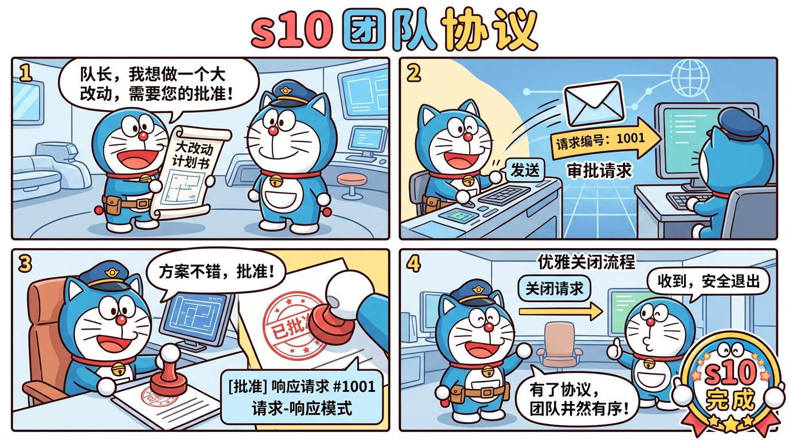

# s10 团队协议 — 请求-响应协商



## 这一节学什么？

**一句话**：团队成员做大改动前，要先请示队长批准。通过 `request_id` 匹配请求和响应。

没有协议的团队就像没有审批流程的公司——谁都能随便改线上代码。

## 核心概念

### 协议跟踪器

```typescript
interface ProtocolRequest {
  id: string;                              // 唯一请求ID
  type: "shutdown" | "plan_approval";      // 协议类型
  from: string;                             // 发起人
  plan?: string;                            // 计划详情
  status: "pending" | "approved" | "rejected";
  feedback?: string;                        // 审批反馈
}

const protocolTracker = new Map<string, ProtocolRequest>();
```

### 两种协议

**1. 计划审批（plan_approval）**

```
队员 → 队长："我想重构整个数据库层"（request_id: abc123）
队长 → 审查 → 队员："批准"或"拒绝：风险太大"（同一个 request_id）
```

```typescript
// 队员发起
if (b.name === "plan_approval") {
  const reqId = randomUUID().slice(0, 8);
  protocolTracker.set(reqId, {
    id: reqId, type: "plan_approval",
    from: name, plan: input.plan, status: "pending"
  });
  bus.send("lead", {
    type: "plan_approval", from: name,
    content: input.plan,
    extra: { request_id: reqId }
  });
}

// 队长审批
if (b.name === "approve_plan") {
  const req = protocolTracker.get(input.request_id);
  req.status = input.approve ? "approved" : "rejected";
  bus.send(req.from, {
    type: "plan_approval_response",
    content: input.approve ? "Approved" : `Rejected: ${input.feedback}`,
    extra: { request_id: req.id, approve: input.approve }
  });
}
```

**2. 优雅关闭（shutdown_request）**

```
队长 → 队员："请安全退出"（request_id: xyz789）
队员 → 保存工作 → 队长："收到，已安全退出"
```

```typescript
// 队员收到关闭请求
if (msg.type === "shutdown_request") {
  bus.send("lead", {
    type: "shutdown_response",
    content: "Approved",
    extra: { request_id: reqId, approve: true }
  });
  shouldExit = true;
}
```

### 为什么需要 request_id？

因为通信是**异步**的。可能同时有多个审批请求在进行中，需要用 ID 来匹配"哪个响应对应哪个请求"。

```
时间线：
  t1: 队员A 发送审批请求 (id: aaa)
  t2: 队员B 发送审批请求 (id: bbb)
  t3: 队长批准 id:bbb
  t4: 队长拒绝 id:aaa
```

## 源码映射

| 蒸馏版 | Claude Code 原版 | 原始行数 |
|--------|-----------------|---------|
| `ProtocolTracker` | `coordinatorMode.ts` | 369 行 |
| shutdown | `shutdownProtocol.ts` | 200 行 |
| plan_approval | `permissionBridge.ts + leaderBridge.ts` | 350 行 |
| **总计** | | **1,039 → ~450 行 (2.3:1)** |

## 动手试试

```bash
npx tsx src/s10_protocols.ts
```

试试：
- `创建一个队员，让他做一个需要审批的重大改动`
- 观察审批流程
- 输入 `team` 查看状态

## 小测验

1. **如果队长不回复审批请求，队员会怎样？** 需要加什么机制？
2. **能不能让队员之间也互相审批？** 怎么改？
3. **为什么用 `randomUUID` 而不是自增数字？** 提示：多个队员并发时

---

> 下一节：[s11 自主Agent](./s11-autonomous.md) — 不用指派，自己找活干
