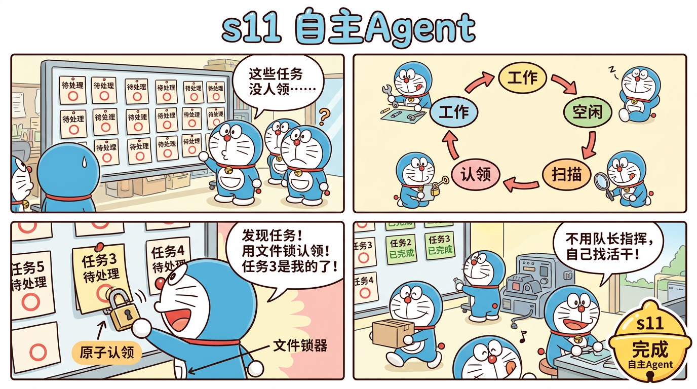

# s11 自主Agent — 不用指派，自己找活干



## 这一节学什么？

**一句话**：s09-s10 的队员需要队长分配任务。s11 的队员能**自己扫描任务板、认领任务、完成后继续找新任务**。

这就像一个高效团队——不用老板盯着，每个人自驱动。

## 核心概念：状态机

每个自主 Agent 按以下状态循环：

```
┌─→ 工作 (WORK)
│     ↓ （工作完成，调用 idle）
│   空闲 (IDLE)
│     ↓ （开始扫描任务板）
│   扫描 (SCAN)
│     ↓ （发现未认领任务）
│   认领 (CLAIM)
│     ↓ （认领成功）
└───┘
```

### 工作阶段（WORK）

和普通 Agent 一样，执行工具完成任务。完成后调用 `idle` 工具进入空闲状态。

### 扫描阶段（SCAN）

```typescript
scanUnclaimed(): Task[] {
  return this.listAll().filter((t) =>
    t.status === "pending" &&    // 还没开始
    !t.owner &&                   // 没人认领
    t.blockedBy.length === 0      // 没有未完成的依赖
  );
}
```

### 认领阶段（CLAIM）— 文件锁

```typescript
claim(id: string, owner: string): boolean {
  const lockFile = join(TASKS_DIR, `_claim_lock`);
  if (existsSync(lockFile)) return false;   // 有人在认领，退让

  try {
    writeFileSync(lockFile, owner);          // 抢锁
    const t = this.get(id);
    if (!t || t.owner || t.status !== "pending") {
      unlinkSync(lockFile);                   // 任务已被别人拿走
      return false;
    }
    t.owner = owner;
    t.status = "in_progress";
    this.save(t);
    unlinkSync(lockFile);                     // 释放锁
    return true;
  } catch {
    unlinkSync(lockFile);
    return false;
  }
}
```

**为什么需要文件锁？** 多个 Agent 可能同时看到同一个任务并尝试认领。文件锁确保只有一个能成功。

### 空闲超时

```typescript
let idleTime = 0;
while (idleTime < IDLE_TIMEOUT) {       // 15秒超时
  const unclaimed = taskMgr.scanUnclaimed();
  if (unclaimed.length > 0) {
    if (taskMgr.claim(task.id, name)) {
      // 认领成功 → 回到工作
      continue outerLoop;
    }
  }
  await new Promise(r => setTimeout(r, POLL_INTERVAL));  // 等3秒再扫描
  idleTime += POLL_INTERVAL;
}
// 超时 → 自动退出
```

### 身份保持

Agent 上下文被压缩后，可能"忘记自己是谁"。解决方案：

```typescript
if (msgs.length <= 3) {
  msgs.unshift({
    role: "user",
    content: `You are "${name}", an autonomous teammate with role: ${role}.`
  });
}
```

## 完整流程示例

```
1. 队长创建 5 个任务
2. 队长 spawn 2 个自主 Agent
3. Agent-A 扫描 → 认领任务 #1 → 工作 → 完成 → idle
4. Agent-B 扫描 → 认领任务 #2 → 工作 → 完成 → idle
5. Agent-A 扫描 → 认领任务 #3 → 工作 → 完成 → idle
6. Agent-B 扫描 → 认领任务 #4 → ...
7. 所有任务完成 → 扫描无结果 → 超时 → 自动退出
```

## 源码映射

| 蒸馏版 | Claude Code 原版 | 原始行数 |
|--------|-----------------|---------|
| 状态机 | `autonomousMode.ts` | 480 行 |
| `scanUnclaimed()` | `getUnclaimedTasks()` | 60 行 |
| `claim()` | `claimWithLock()` | 120 行 |
| 身份保持 | `injectIdentity()` | 45 行 |
| **总计** | | **795 → ~500 行 (1.6:1)** |

## 动手试试

```bash
npx tsx src/s11_autonomous.ts
```

试试：
- `创建5个简单任务，然后生成2个自主Agent来完成它们`
- 输入 `tasks` 查看任务认领和完成情况

## 小测验

1. **如果两个 Agent 同时扫描到同一个任务？** 文件锁够安全吗？
2. **IDLE_TIMEOUT 设多长合适？** 太短和太长分别有什么问题？
3. **自主 Agent 和 s04 子Agent 的本质区别是什么？**

---

> 下一节：[s12 Git隔离](./s12-worktree.md) — 用 Git Worktree 隔离工作空间
