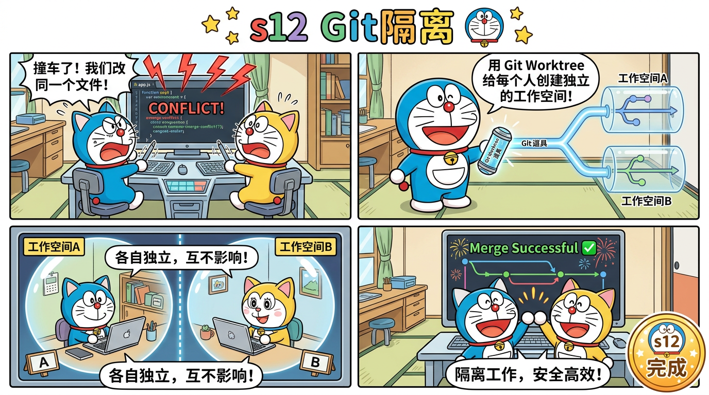

# s12 Git隔离 — Worktree 并行工作空间



## 这一节学什么？

**一句话**：多个 Agent 同时改代码会冲突。Git Worktree 给每个 Agent 一个独立目录，互不干扰。

这是 Claude Code 多Agent系统的最后一块拼图——工作空间隔离。

## 问题

s09-s11 的多个 Agent 都在**同一个目录**下工作。如果 Agent-A 在改 `app.ts`，Agent-B 也在改 `app.ts`，就会互相覆盖。

## 解决方案：Git Worktree

Git Worktree 是 Git 的内置功能——可以从同一个仓库创建多个工作目录，每个目录有自己的分支。

```
项目仓库/
├── (主工作目录)              ← 队长在这里
├── .worktrees/
│   ├── feature-login/       ← Agent-A 的隔离空间
│   └── fix-bug-123/         ← Agent-B 的隔离空间
└── .tasks/
    ├── task_1.json           ← 绑定到 feature-login
    └── task_2.json           ← 绑定到 fix-bug-123
```

## 核心概念

### WorktreeManager

```typescript
class WorktreeManager {
  create(name: string, taskId?: string): string {
    const branch = `wt/${name}`;
    const wtPath = join(this.repoRoot, ".worktrees", name);

    // 从当前 HEAD 创建新分支 + 新工作目录
    const baseRef = execSync("git rev-parse HEAD").trim();
    execSync(`git worktree add -b "${branch}" "${wtPath}" "${baseRef}"`);

    // 绑定到任务
    if (taskId) {
      taskMgr.update(taskId, { worktree: name, status: "in_progress" });
    }

    return `Created worktree "${name}" at ${wtPath}`;
  }

  run(name: string, command: string): string {
    const wt = this.findWorktree(name);
    // 在 worktree 目录下执行命令
    return execSync(command, { cwd: wt.path });
  }

  remove(name: string, completeTask?: boolean): string {
    execSync(`git worktree remove "${wt.path}" --force`);
    execSync(`git branch -D "${wt.branch}"`);
    if (completeTask && wt.taskId) {
      taskMgr.update(wt.taskId, { status: "completed" });
    }
  }
}
```

### 任务绑定

每个任务可以绑定到一个 worktree：

```typescript
interface Task {
  // ... 原有字段 ...
  worktree?: string;  // 绑定的 worktree 名称
}
```

创建 worktree 时自动绑定，删除 worktree 时可以自动完成任务。

### 事件日志

```typescript
function emitEvent(event: string, data: Record<string, unknown>) {
  appendFileSync(
    join(WORKTREE_DIR, "events.jsonl"),
    JSON.stringify({ event, timestamp: Date.now(), ...data }) + "\n"
  );
}
```

所有 worktree 操作都记录日志，便于追踪和调试。

## 完整工作流

```
1. 队长创建任务 #1: "实现登录"
2. 队长创建 worktree:
   worktree_create("feature-login", task_id: "1")
   → 创建 .worktrees/feature-login/ 目录
   → 创建 wt/feature-login 分支
   → 任务 #1 状态变为 in_progress

3. 在 worktree 中工作:
   worktree_run("feature-login", "echo 'console.log(1)' > login.ts")

4. 工作完成，删除 worktree:
   worktree_remove("feature-login", complete_task: true)
   → 删除目录和分支
   → 任务 #1 状态变为 completed
```

## 对比总结：12个阶段的演进

| 阶段 | 能力 | 代码量 |
|------|------|--------|
| s01 | 循环 + 1个工具 | ~100 行 |
| s02 | 4个工具 + 分发表 | ~200 行 |
| s03 | 计划能力 | ~250 行 |
| s04 | 子Agent委托 | ~300 行 |
| s05 | 技能/规则注入 | ~350 行 |
| s06 | 三层上下文压缩 | ~400 行 |
| s07 | 文件任务图+DAG | ~350 行 |
| s08 | 后台并发 | ~350 行 |
| s09 | Agent团队 | ~450 行 |
| s10 | 团队协议 | ~450 行 |
| s11 | 自主Agent | ~500 行 |
| s12 | Git隔离 | ~550 行 |

**从 100 行到完整的多 Agent 系统，这就是 Claude Code 的核心架构！**

## 源码映射

| 蒸馏版 | Claude Code 原版 | 原始行数 |
|--------|-----------------|---------|
| `WorktreeManager` | `utils/worktree.ts` | 1,519 行 |
| `worktree_create` | `EnterWorktreeTool/` | 127 行 |
| `worktree_run` | `execInWorktree()` | 80 行 |
| `worktree_remove` | `ExitWorktreeTool/` | 300 行 |
| 事件日志 | `events.jsonl` | 40 行 |
| **总计** | | **2,126 → ~550 行 (3.9:1)** |

## 动手试试

```bash
npx tsx src/s12_worktree.ts
```

注意：需要在 Git 仓库中运行。试试：
- `创建一个任务和对应的 worktree`
- `在 worktree 中创建文件`
- `完成后清理 worktree`
- 输入 `wt` 查看活跃的 worktree
- 输入 `tasks` 查看任务状态

## 小测验

1. **Git Worktree 和 Git Branch 有什么区别？** Branch 不够吗？
2. **如果 worktree 中的修改需要合并回主分支，怎么做？**
3. **为什么不用 Docker 容器做隔离？** Worktree 有什么优势？

---

## 恭喜！你已经完成了全部 12 个阶段的学习！

从一个简单的 `while(true)` 循环到完整的多 Agent 协作系统，你已经理解了 Claude Code 50 万行代码的核心架构。

> 回到 [README](../../README.md) | 查看 [架构文档](../architecture.md) | 查看 [源码映射](../source-mapping.md)
